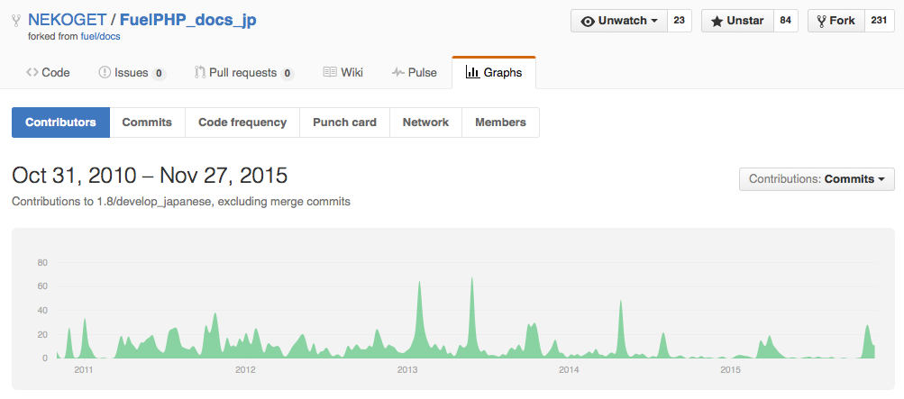

# Day 01　FuelPHP 1.8-dev 公式ドキュメントの翻訳が完了しました！

[FuelPHP Advent Calendar 2015](http://qiita.com/advent-calendar/2015/fuelphp) の1日目です。まだ、空きがありますので、興味のある方は気軽に参加してください。

## FuelPHPドキュメント翻訳の歴史

そもそもFuelPHPの公式ドキュメントの翻訳が始まったのは、2011年11月10日に遡ります。

> うぉ、 [@NEKOGET](https://twitter.com/NEKOGET) さんがFuelPHPのドキュメントの翻訳始めてる <http://t.co/REL9qEh5> [\#fuelphp](https://twitter.com/hashtag/fuelphp?src=hash)
>
> — kenjis (@kenji\_s) [November 9, 2011](https://twitter.com/kenji_s/status/134396137313550337)

GitHubで本家のドキュメントリポジトリがフォークされ、日本語翻訳のためのリポジトリが作成されました。

-   <https://github.com/NEKOGET/FuelPHP_docs_jp>

その時のFuelPHPのバージョンは1.2でした。

それから4年、ずっと翻訳は続き、今回初めて全ページの翻訳が完了し、本家の最新ドキュメント（1.8-dev）に追いつきました！

> [\#FuelPHP](https://twitter.com/hashtag/FuelPHP?src=hash) 1.8-dev ドキュメントの翻訳 <https://t.co/8dSxWhgtGU> 翻訳率100%を達成しました!!! <https://t.co/2nX3nVXvmY> [\#fueldocsja](https://twitter.com/hashtag/fueldocsja?src=hash)
>
> — kenjis (@kenji\_s) [November 26, 2015](https://twitter.com/kenji_s/status/670027244471848960)

## FuelPHP日本語ドキュメントの現状

最新の日本語ドキュメントは以下から閲覧できます。

-   <http://fuelphp.jp/docs/1.8/>

これは、本家`1.8/develop`ブランチのドキュメントの翻訳です。つまり、1.x系の最新の開発版のドキュメントです。原文の内容は開発やドキュメントのバグ修正に伴い変わっていきます。php7に対応したFuelPHP 1.7.4がリリースされれば、その時点では1.7.4のドキュメントになります。

一方、以下はFuelPHP 1.7.0がリリースされる直前の本家`1.7/develop`ブランチが原文のため、かなり古いです。ご注意下さい。

-   <http://fuelphp.jp/docs/1.7/>

1.7.4がリリースされたら、`1.8/develop_japanese`をこのURLにマージできれば、わかりやすくなると思います。

## 日本のFuelPHPコミュニティは素晴らしい

FuelPHPはコミュニティにより開発されているフレームワークであり、この翻訳もコミュニティにより進められています。

翻訳が今まで続き、一通り完了したことは、ひとえに日本のコミュニティの力であり、日本のFuelPHPコミュニティは本当に素晴らしいです。

今までに以下の方がこの翻訳に参加しています（クレジットに名前を記載していない人は除く）。

-   Fumito Mizuno <https://github.com/ounziw>
-   Hitoshi Asano <https://github.com/orcaaoshi>
-   Kazuma Watanabe <https://github.com/wata727>
-   Kenji Suzuki <https://github.com/kenjis>
-   Makoto Taniguchi <https://github.com/h2ospace>
-   Mamoru Otsuka <https://github.com/mp-php>
-   Mizuki Yamanaka <https://github.com/charlesvineyard>
-   Naoki Morita <https://github.com/morita21>
-   Naoki Sekiguchi <https://github.com/seckie>
-   Shintaro Inagaki <https://github.com/shinagaki>
-   Shiro Matsuo <https://github.com/mazzo46>
-   Sohei Iwahori <https://github.com/egmc>
-   Soichiro Miki <https://github.com/miki-soichiro>
-   Taichi Inaba <https://github.com/chatii>
-   Taiji Inoue <https://github.com/inouet>
-   Tatsuya Ueda <http://github.com/tatsuyaueda>
-   Tetsuji Koyama <https://github.com/koyhoge>
-   Toru Tamura <https://github.com/torut>
-   Yoshiaki Sato <https://github.com/yoshiakist>
-   Yoshiyuki Ieyama <https://github.com/yukku0423>
-   Yuuki Arita <https://github.com/raben>
-   pandamachine715 <https://github.com/pandamachine715>
-   sharkpp <https://github.com/sharkpp>
-   sj-i <https://github.com/sj-i>
-   toru81 <https://github.com/toru81>

<https://github.com/NEKOGET/FuelPHP_docs_jp/blob/1.8/develop_japanese/CREDITS.md> より。

## 翻訳に参加したい方へ

翻訳はGitHubのリポジトリにPull Requestすることで進められています。細かいことは、以下のREADMEをご覧下さい。

-   <https://github.com/NEKOGET/FuelPHP_docs_jp/blob/1.8/develop_japanese/README.md>

一通り完了したとはいえ、今後も原文の更新に合わせて翻訳は続いていきます。

また、既存の翻訳の誤り、日本語としてこなれていない箇所、表記の不統一など改良の余地はまだあると思います。

そういうわけで、みなさんのご参加をお待ちしています。

GitHubやGitの細かい使い方がよくわからないという方は、私の電子書籍『[FuelPHPに貢献する方法](https://leanpub.com/how_to_contribute_fuelphp_ja)』をご覧下さい（無料で入手できます）。一部、GitHubのスクリーンショットが古いですが、最近、半分以上を最新のものに更新しました。

## ドキュメント翻訳に関して一番言いたいこと

さて、FuelPHPのドキュメントは一通り翻訳が完成して万歳！という感じですが、ドキュメントの翻訳という問題は今後もドキュメントが更新される度に、また、他のオープンソースプロジェクトにも存在します。

基本的には多くのプロジェクトで翻訳に参加する人が足りず、あまり翻訳が進まない、あるいは、うまく行っていそうなプロジェクトでも1人か2人でやっているという、トラックナンバー（その人数がトラックに引かれたらプロジェクトが進まなくなる数のこと）が非常に少ない危険な状態だったりすることもあります。

ということで、少しでも翻訳に興味があれば、是非、自分の使っているソフトウェアの翻訳プロジェクトに参加してみてください。技術文書の翻訳は基本的にはそんなに難しくありません。

また、母国語でドキュメントが読める、学習できるということは非常に重要なことです。もし、あなたが日本語で学習してきた経験があるなら、これから学習する人も日本語で学習できるように少しだけ手助けすることについて考えてみてください。

例えば、FuelPHPのドキュメントは現在163ページあります。仮に163人で翻訳すれば1人1ページで完成します。

それから、翻訳を改善するフィードバック方法があり機能している限り、翻訳が間違っていたり、よくない翻訳だったりすることは問題ではありません。翻訳は誰がやっても間違えるものです。

「腐った翻訳」などとブログで一方的に批難する必要はありませんし、あまり有効な方法とは言えません。誤訳を修正し、翻訳の質を改善したものをフィードバックしてください。FuelPHPのドキュメント翻訳では [Pull Request](https://github.com/NEKOGET/FuelPHP_docs_jp/pulls) です。

少なくとも、SNSやブログなどで一方的に翻訳について批難するのは、フィードバック方法がなかったりまったく機能していない場合の最後の手段にするのがよいと思います。

## まとめ

-   4年の歳月をかけ、FuelPHPドキュメントの翻訳が完了しました。この偉業をみなさん褒めたたえましょう！
-   できたらドキュメント翻訳プロジェクトに参加してみましょう。
-   よくない翻訳を見かけたら、修正をフィードバックしましょう。

## 関連

-   [FuelPHP 1.8-dev ドキュメント](http://fuelphp.jp/docs/1.8/)
-   [FuelPHPドキュメント翻訳のリポジトリ](https://github.com/NEKOGET/FuelPHP_docs_jp)
-   [FuelPHP Advent Calendar 2015](http://qiita.com/advent-calendar/2015/fuelphp)

---
オリジナル：　<http://blog.a-way-out.net/blog/2015/12/01/fuelphp-docs-translation-completed/>
