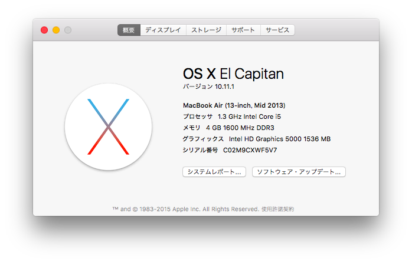
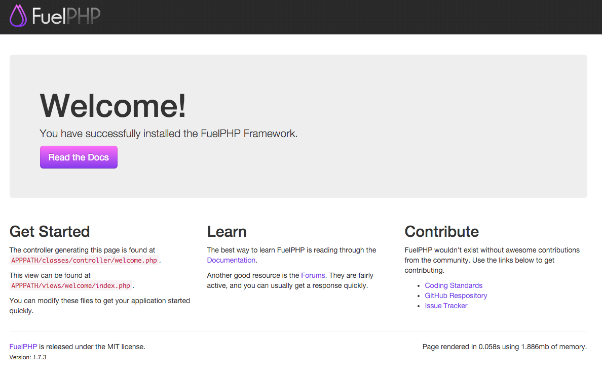

# Day 02　FuelPHP 1.7.3 のインストール


こんにちは。2015年 FuelPHP Advent Calendar 2日目を担当させて頂く @ken880guchi です。宜しくお願いします。

## 環境

タイトルのとおリ Mac OS X El Capitan 10.11.1 です。



## FuelPHP インストール

今回は、公式のドキュメント[FuelPHP 1.7.3 Documentation](http://fuelphp.com/docs/)に従って oil コマンドのインストールから進めて行きたいと思います。

### そもそも oil ってなに？

oil コマンドは FuelPHP でのアプリケーション開発を補助する役割を担っており、Controller, Model, View の生成やデータベースのマイグレーション、パッケージのインストール、更新および削除、PHPUnit テストの実行等を行ってくれます。


### oil のインストール

早速 oil コマンドのインストールを行います。しかし、コケてしまいました...

{lang="sh"}
``` sh
$ curl get.fuelphp.com/oil | sh

% Total    % Received % Xferd  Average Speed   Time    Time     Time  Current
                                 Dload  Upload   Total   Spent    Left  Speed
100   385  100   385    0     0    511      0 --:--:-- --:--:-- --:--:--   511

# あれ、コケてる...
sh: /usr/bin/oil: Operation not permitted
chmod: /usr/bin/oil: No such file or directory
``` 

### ElCapitan から書き込めない `/usr/bin` には書き込めない

ElCapitan からは、Apple がセキュリティへ配慮してくれたことにより、`/usr/bin` を含む下記のディレクトリに対してはシステムからしか書き込むことが出来なくなりました(root 権限でも書き込めません)。

``` システムからのみ書き込み可能
/bin
/sbin
/usr
/System
``` 

しかし、以下のディレクトリは ElCapitan 以前と同様にユーザーが書き込むことが可能です。

``` 以前と同様に書き込み可能
/usr/local
/Applications
[~]/Library
``` 

### `/usr/bin` と `/usr/local/bin` の用途

そもそも、自身の理解として `/usr/bin` と `/usr/local/bin` の用途の違いを理解出来ていませんでした。
調べてみると下記であることが解りました。

| Directory      | 用途        |
|----------------|-------------| 
| /usr/bin       | システム標準のコマンドを格納。システムからの更新以外は基本的に更新もを行わない。 |
| /usr/local/bin | ユーザーが自身で新規に追加するコマンドを格納|

上記から、oil のインストール用スクリプト内の `/usr/bin` に書き込む振る舞いを `/usr/local/bin` に書き込むように変更すれば良いのではと思いました。

### あらためて、oil のインストール

はじめに、インストール用のスクリプトを書き出して覗いてみます。

``` sh 
# インストール用のスクリプトを書き出し
$ curl get.fuelphp.com/oil > oil_install.sh

# インストール用のスクリプトを参照
$ cat oil_install.sh | pbcopy
```

{title="oil_install.sh"}
``` oil_install.sh
#!/bin/bash

PREFIX="/usr/bin/"

install_oil() {

    if [ `which sudo` ]; then
        sudo sh -c "curl --silent http://get.fuelphp.com/installer.sh > ${PREFIX}oil"
        sudo chmod +x ${PREFIX}oil
    else
        sh -c "curl --silent http://get.fuelphp.com/installer.sh > ${PREFIX}oil"
        chmod +x ${PREFIX}oil
    fi
}

#
# Handle execution
#
main() {

  # Start installation
  install_oil
  exit 0
}

main
```

3 行目の `PREFIX="/usr/bin/"` を `PREFIX="/usr/local/bin/"` へ変更して保存。実行します。

{lang="sh"}
``` sh
# あらためて、インストール
$ sh oil_install.sh

# パスワードを入力 (インストール成功とかは出ない)
Password: 
```

インストールされた `oil` コマンドを読み込む為に、Terminal を切り替える(または再起動)させて、 `oil` コマンドからプロジェクトを生成出来ることを確認します。

{lang="sh"}
``` sh
$ oil create blog

Cloning into './blog'...
remote: Counting objects: 15318, done.
remote: Total 15318 (delta 0), reused 0 (delta 0), pack-reused 15318
Receiving objects: 100% (15318/15318), 5.34 MiB | 925.00 KiB/s, done.
Resolving deltas: 100% (6169/6169), done.
Checking connectivity... done.
Already on '1.7/master'
Your branch is up-to-date with 'origin/1.7/master'.
Updating to version f084b1e053850730783a012a0a772012d8cbd949.
    Downloading: 100%
Use composer self-update --rollback to return to version e77435cd0c984e2031d915a6b42648e7b284dd5c
Loading composer repositories with package information
Updating dependencies (including require-dev)
  - Installing composer/installers (v1.0.22)
    Loading from cache

  - Installing fuel/docs (dev-1.7/master 473174d)
    Cloning 473174da2cf503c60d4a9935b71acfc31f0906d0

  - Installing fuel/core (dev-1.7/master f614b30)
    Cloning f614b30e1f76389580c2d97991ab3f25c1533a29

  - Installing fuel/auth (dev-1.7/master aa9bd2e)
    Cloning aa9bd2e5104026814ff516aacf03258f62a94a55

  - Installing fuel/email (dev-1.7/master 8fbf378)
    Cloning 8fbf378d74bac170a96cad96ba0aed77e319a865

  - Installing fuel/oil (dev-1.7/master ea37c3a)
    Cloning ea37c3a7fe8675fb3327327213b2eca55303933a

  - Installing fuel/orm (dev-1.7/master 5e05c30)
    Cloning 5e05c3068562548657fea69850a23b23f65a5545

  - Installing fuel/parser (dev-1.7/master 0cacd10)
    Cloning 0cacd10d7b1b8f92a0eeddce75c6ba2c0c28112f

  - Installing fuelphp/upload (2.0.2)
    Loading from cache

  - Installing psr/log (1.0.0)
    Loading from cache

  - Installing monolog/monolog (1.5.0)
    Loading from cache

  - Installing michelf/php-markdown (1.4.0)
    Loading from cache

monolog/monolog suggests installing mlehner/gelf-php (Allow sending log messages to a GrayLog2 server)
monolog/monolog suggests installing raven/raven (Allow sending log messages to a Sentry server)
monolog/monolog suggests installing doctrine/couchdb (Allow sending log messages to a CouchDB server)
monolog/monolog suggests installing ext-amqp (Allow sending log messages to an AMQP server (1.0+ required))
monolog/monolog suggests installing ext-mongo (Allow sending log messages to a MongoDB server)
Writing lock file
Generating autoload files
    Made writable: /Users/kenya/adventcalendar2015/fuelphp/blog/fuel/app/cache
    Made writable: /Users/kenya/adventcalendar2015/fuelphp/blog/fuel/app/logs
    Made writable: /Users/kenya/adventcalendar2015/fuelphp/blog/fuel/app/tmp
    Made writable: /Users/kenya/adventcalendar2015/fuelphp/blog/fuel/app/config
    

# 無事にエラーなくプロジェクトの生成が行えました。
```

### `oil create blog` で、最後に timezone のエラーが発生してしまう場合

下記のようなエラーがプロジェクト生成の最後に発生する場合、はじめに ```php --ini``` コマンドで読み込んでいる設定ファイルを確認し、date.timezone の設定を行なうことで解決できます。

{lang="sh"}
``` sh
# timezone の設定を行っていなかったのでエラーが発生
Error - date_default_timezone_get(): It is not safe to rely on the system's timezone settings. You are *required* to use the date.timezone setting or the date_default_timezone_set() function. In case you used any of those methods and you are still getting this warning, you most likely misspelled the timezone identifier. We selected the timezone 'UTC' for now, but please set date.timezone to select your timezone. in COREPATH/classes/fuel.php on line 162

# 読み込んでいる設定ファイルを確認
$ php --ini

Configuration File (php.ini) Path: /usr/local/etc/php/5.5

#                                   読み込んでいる設定ファイルのパス
#                                  vvvvvvvvvvvvvvvvvvvvvvvvvvvvvv
Loaded Configuration File:         /usr/local/etc/php/5.5/php.ini

Scan for additional .ini files in: /usr/local/etc/php/5.5/conf.d
Additional .ini files parsed:      /usr/local/etc/php/5.5/conf.d/ext-intl.ini,
/usr/local/etc/php/5.5/conf.d/ext-phalcon.ini

# 設定ファイルを参照
$ vim /usr/local/etc/php/5.5/php.ini
```

{title="php.ini"}
``` php.ini
# Asia/Tokyo を設定
date.timezone = "Asia/Tokyo"
``` 

## 動作確認

{lang="sh"}
```
# 生成したプロジェクトへ移動
$ cd blog 

# サーバーを起動
$ oil server
Listening on http://localhost:8000
Document root is public
Press Ctrl-C to quit.
```

<http://localhost:8000> にアクセスしてみましょう。
下記の画面が表示されれば FuelPHP のインストールは完了です。




## ［おまけ 1］ `oil` について

oil コマンドの実体は bash と php の 2 種類が存在します。最初にプロジェクト生成用に使用した oil コマンドは bash の oil です。生成されたプロジェクト内で built-in server を起動するために用いた oil コマンドが php の oil になります。

## ［おまけ 2］ 今回使用した oil コマンドについて

create と server コマンドの振る舞いについて確認してみました。余談ですが、普段記述しない shell のコードを読む機会になったり、知らなかった php の関数に出会うことが出来て楽しかったです。

### create

- `oil` コマンドを実行時のカレントディレクトリに oil ファイルが存在する場合
 - `php oil` コマンドにすべての引数を渡して実行し、処理が終了します
- else
 - 第一引数に create が設定されている場合
     - git がインストールされていない場合
           - git をインストールして欲しい旨をメッセージとして表示して、<http://git-scm.com/> へ案内します
           - 処理を終了します
        - git://github.com/fuel/fuel.git リポジトリを git clone します。生成するディレクトリ名は 第2引数を使用します。
        - 生成されたプロジェクトのディレクトリへ移動します。
        - サブモジュール含めて、最新バージョンのマスターブランチへ切り替え
        - composer 自体のアップデート
        - composer.json を使用して、fuelphp 標準の core や orm をインストール
        - oil refine install で core/tasks/install.php を実行して、 cache, logs, tmp, config ディレクトリを 0777 で生成
        - 処理を終了します
 - 第一引数に create が設定されていない場合
     - 有効なオプションではない旨をメッセージとして表示して、<http://fuelphp.com/docs/installation/instructions.html> へ案内します
     - 処理を終了します

### server

- 第 2 引数が設定されている。かつ help の場合
    - `oil server` コマンドのヘルプを表示します
    - 処理を終了します
- else
    - php のバージョンが 5.4 以上を使用していない場合
        - built-in server は 5.4 以上から利用できる旨を表示
        - 処理を終了します
    - php の passthru 関数から `php -S localhost:8000 -t public fuel/packages/oil/phpserver.php` コマンドを実行して built-in server を起動します。
    - 処理を終了します

## 次回

今回、構築した環境を元に、次回 FuelPHP 1.7.3 を実際に触って行きたいと思います。

## 今回参考にさせて頂いたサイト様

* [通信用語の基礎知識 - /usr/local/bin](http://www.wdic.org/w/TECH//usr/local/bin)
* [Mac Developer Library — Prerelease - File System Protections](https://developer.apple.com/library/prerelease/mac/documentation/Security/Conceptual/System_Integrity_Protection_Guide/FileSystemProtections/FileSystemProtections.html#//apple_ref/doc/uid/TP40016462-CH2-SW1)

---
オリジナル：　<http://qiita.com/ken880guchi/items/a089f692109083e9e25e>
