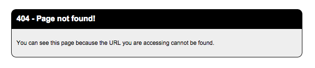
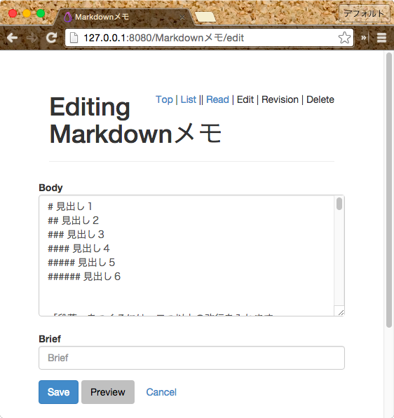
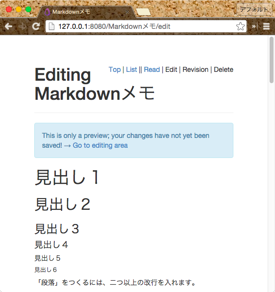
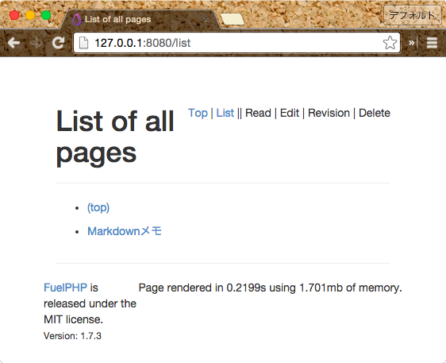
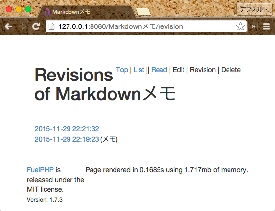
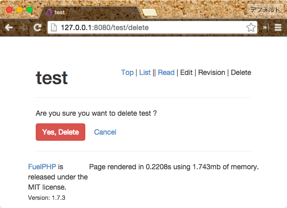

# Day 04　Markdown Wiki を通して Temporal Model の使い方を覚えよう

こんにちは、こんばんは、[FuelPHP Advent Calendar 2015](http://qiita.com/advent-calendar/2015/fuelphp) の 4 日目を担当する [@sharkpp](https://twitter.com/sharkpp) です。

今回は Temporal Model を使って Markdown で記述できる簡易 Wiki を作ってみることにします。

題して「Markdown Wiki を通して Temporal Model の使い方を覚えよう」です。

完成品は [md-micro-wiki @ github.com](https://github.com/sharkpp/md-micro-wiki) にコミットし [Vagrant](https://www.vagrantup.com/) を使って簡単に試せるようにしてあります。

## はじめに {#E381AFE38198E38281E381AB}

Markdwon で記述できる簡単な Wiki の作成を通して [Temporal Model](http://fuelphp.com/docs/packages/orm/model/temporal.html) (日本語訳は [Temporal Model @ fuelphp.jp](http://fuelphp.jp/docs/1.8/packages/orm/model/temporal.html) を参照) の使い方を説明してみようと思います。

作るものの要件として

-   FuelPHP 1.7.3 を使用
-   履歴が残せる簡易な Wiki アプリ
-   Model\_Temporal クラスを使用
-   Markdown で本文を記述
-   ログイン管理は長くなるので省略

を簡単に決め作ってみました。

また、なるべく Oil コマンドの Generate 機能でスケルトンを作り実装の速度を上げてみたいと思います。

## 環境の準備 {#E792B0E5A283E381AEE6BA96E58299}

データベースは FuelPHP の開発環境デフォルトの

|項目名          |値          |
|----------------|-----------|
|データベース名   |fuel\_dev  |
|ユーザー名       |root       |
|パスワード       |root       |

とします。

## FuelPHP のインストール {#fuelphp-E381AEE382A4E383B3E382B9E38388E383BCE383AB}

[Instruction](http://fuelphp.com/docs/installation/instructions.html) (日本語訳は [インストール方法 @ fuelphp.jp](http://fuelphp.jp/docs/1.8/installation/instructions.html) を参照) を確認しながら、 Composer を使い、サクッとインストールします。

この時、PHP のタイムゾーンを設定しておかないとエラーが発生してインストール処理が中断するので注意です。

    $ composer create-project fuel/fuel:dev-1.7/master --prefer-dist md-micro-wiki

Welcome ページもいらないので削除します。

    $ cd md-micro-wiki
    $ rm -rf fuel/app/{classes/{controller/welcome.php,presenter/welcome/},views/welcome/}
    $ touch fuel/app/classes/presenter/.gitkeep

この状態でアクセすると 404 ページの表示になります。

## 実装 {#E5AE9FE8A385}

### モデルやコントローラなどのスケルトンを追加 {#E383A2E38387E383ABE38284E382B3E383B3E38388E383ADE383BCE383A9E381AAE381A9E381AEE382B9E382B1E383ABE38388E383B3E38292E8BFBDE58AA0}

[Introduction - Orm Package](http://fuelphp.com/docs/packages/orm/intro.html) (日本語訳は [はじめに - Orm パッケージ @ fuelphp.jp](http://fuelphp.jp/docs/1.8/packages/orm/intro.html) を参照) を参考にORM パッケージを有効化します。

`fuel/app/config/config.php`

{lang="diff", linenos=off}
    @@ -256,7 +256,7 @@
        /**************************************************************************/
        /* Always Load                                                            */
        /**************************************************************************/
    -   // 'always_load'  => array(
    +   'always_load'  => array(

            /**
             * These packages are loaded on Fuel's startup.
    @@ -269,9 +269,9 @@
             *     array('auth' => PKGPATH.'auth/')
             * );
             */
    -       // 'packages'  => array(
    -       //  //'orm',
    -       // ),
    +       'packages'  => array(
    +           'orm',
    +       ),

            /**
             * These modules are always loaded on Fuel's startup. You can specify them
    @@ -307,6 +307,6 @@
             * If you don't want the lang in a group use null as groupname.
             */
            // 'language'  => array(),
    -   // ),
    +   ),

     );

Oil コマンドの Generate 機能を使い、モデルやコントローラ、ビューのスケルトンを作ります。

    $ php oil g controller page list view revision edit delete
    $ php oil g model page title:string body:text body_html:text brief:string --temporal

[Generate - Oil Package](http://fuelphp.com/docs/packages/oil/generate.html#/model_temporal) (日本語訳は [Generate - Oil パッケージ @ fuelphp.jp](http://fuelphp.jp/docs/1.8/packages/oil/generate.html#/model_temporal) を参照) の注意に書かれているように、マイグレーションコードを修正し主キーを設定します。

`fuel/app/migrations/001_create_pages.php`

{lang="diff", linenos=off}
                'body_html' => array('type' => 'text'),
                'brief' => array('constraint' => 255, 'type' => 'varchar'),

    -       ), array('id'));
    +       ), array('id', 'temporal_start', 'temporal_end'));
        }

        public function down()

マイグレーションを実行しテーブルを作成します。

    $ php oil r migrate

### コードを追加 {#E382B3E383BCE38389E38292E8BFBDE58AA0}

ここから若干巻きで進めます。

1.  ルーティング、モデル、ビューテンプレートの実装
2.  ページ編集画面の実装
3.  ページ表示画面の実装
4.  ページ一覧表示画面の実装
5.  ページ編集履歴の実装
6.  ページ削除画面の実装

の順番で実装を行います。

ルーティングをごそっと変えて、ページの表示、編集、履歴表示、削除、ができるようにします。

`fuel/app/config/routes.php`

{lang="diff", linenos=off}
     <?php
     return array(
    -   '_root_'  => 'welcome/index',  // The default route
    -   '_404_'   => 'welcome/404',    // The main 404 route
    -   
    -   'hello(/:name)?' => array('welcome/hello', 'name' => 'hello'),
    +   '_root_' => 'page/view',
    +   '(create|edit|revision|list)' => 'page/$1',
    +   'revision/(:num)' => 'page/view//$1',
    +   '(:segment)/(create|edit|revision|delete)' => 'page/$2/$1',
    +   '(:segment)/revision/(:num)' => 'page/view/$1/$2',
    +   '(:segment)' => 'page/view/$1',
     );

Markdown から HTML への変換処理メソッドやオブザーバー、バリデーション、ページタイトルからレコードを探すメソッドなどを実装します。

ページタイトルのカラムを今回は主キーとしていないため、ページタイトルから特定のリビジョンを示すレコードを探すには、

1.  ページタイトルで引っかかる最新のレコードを取得する。
2.  レコードから `id` を取得し、リビジョンを指定し検索。

と、2 回のクエリを発行しないとダメなようです。

`fuel/app/classes/model/page.php`

{lang="diff", linenos=off}
        protected static $_table_name = 'pages';

    +   protected static $_observers = array('Orm\\Observer_Self' => array(
    +    'events' => array('before_save')
    +   ));
    +   
    +   public function _event_before_save()
    +   {
    +       $this->body_html = self::parse_markdown($this->body);
    +   }
    +
    +   public static function parse_markdown($text)
    +   {
    +       $text = preg_replace('!\[\]\((.+?)\)!', '[$1]($1)', $text);
    +       return Markdown::parse(Security::xss_clean($text));
    +   }
    +
    +   public static function validate($factory)
    +   {
    +       $val = Validation::forge($factory);
    +       $val->add_field('title', 'Title', 'max_length[255]|valid_string[specials,dashes]');
    +       $val->add_field('body', 'Body', 'required');
    +       $val->add_field('brief', 'Brief', 'max_length[255]');
    +
    +       return $val;
    +   }
    +
    +   public static function get_by_title($title, $timestamp = null)
    +   {
    +       $page = self::find('first',
    +                                           array(
    +                                               'where' => array( array('title', $title) )
    +                       ));
    +
    +       if ( $page && $timestamp)
    +       {
    +           $page = self::find_revision($page->id, $timestamp);
    +       }
    +
    +       return $page;
    +   }
    +
    +   public static function enum_revisions_by_title($title)
    +   {
    +       if ( (! $page = self::get_by_title($title)) ||
    +                (! $revisions = self::find_revisions_between($page->id)) )
    +       {
    +           return null;
    +       }
    +       return array_reverse($revisions);
    +   }
    +
     }

### ビューテンプレートを修正 {#E38393E383A5E383BCE38386E383B3E38397E383ACE383BCE38388E38292E4BFAEE6ADA3}

`fuel/app/views/template.php`

{lang="diff", linenos=off}
    @@ -11,6 +11,20 @@
     <body>
        

            

    +<?php $action = preg_match('!/(edit|revision|delete)(/[0-9]+)?!', '/' . Uri::string(), $match) ? $match[1] : ''; ?>
    +           

    +               <?php echo Html::anchor('', 'Top'); ?>
    +               |
    +               <?php echo Html::anchor('list', 'List'); ?>
    +               ||
    +               <?php echo '' == $action || 'list' == Uri::string() ? 'Read' : Html::anchor($name, 'Read'); ?>
    +               |
    +               <?php echo '' != $action || 'list' == Uri::string() ? 'Edit' : Html::anchor($name . '/edit', 'Edit'); ?>
    +               |
    +               <?php echo ('revision' == $action && !isset($match[2])) || ('revision' != $action && '' != $action) || 'list' == Uri::string() ? 'Revision' : Html::anchor($name . '/revision', 'Revision'); ?>
    +               |
    +               <?php echo '' != $action || '' == Uri::string() || 'list' == Uri::string() ? 'Delete' : Html::anchor($name . '/delete', 'Delete'); ?>
    +           

                <h1><?php echo $title; ?></h1>
                

     <?php if (Session::get_flash('success')): ?>
    @@ -29,9 +43,15 @@
                    

                

     <?php endif; ?>
    +<?php if ('revision' == $action && isset($match[2])): ?>
    +           

    +               
This is an <?php echo Html::anchor($name . '/revision', 'old revision'); ?> of this page.

    +           

    +<?php endif; ?>
            

            

     <?php echo $content; ?>
    +           

            

            <footer>
                
Page rendered in {exec_time}s using {mem_usage}mb of memory.

### ページ表示用のコントローラメソッドとビュー実装 {#E3839AE383BCE382B8E8A1A8E7A4BAE794A8E381AEE382B3E383B3E38388E383ADE383BCE383A9E383A1E382BDE38383E38389E381A8E38393E383A5E383BCE5AE9FE8A385}

実装すると作成 or 編集したページが表示できるようになります。

`fuel/app/classes/controller/page.php`

{lang="diff", linenos=off}
    -   public function action_view()
    +   public function action_view($name = '', $timestamp = null)
        {
    -       $data["subnav"] = array('view'=> 'active' );
    -       $this->template->title = 'Page &raquo; View';
    -       $this->template->content = View::forge('pa/view', $data);
    +       if ( ! $page = Model_Page::get_by_title($name, $timestamp) ) {
    +           if ( $timestamp) {
    +               throw new HttpNotFoundException;
    +           }
    +           Response::redirect($name . '/edit');
    +       }
    +
    +       $this->template->title = (empty($name) ? '(top)' : $name);
    +       $this->template->name = $name;
    +       $this->template->content = View::forge('page/view')
    +                                   ->set_safe('page', $page);
        }

`fuel/app/views/page/view.php`

    <?php echo $page->body_html; ?>

### ページ編集用のコントローラメソッドとビュー実装 {#E3839AE383BCE382B8E7B7A8E99B86E794A8E381AEE382B3E383B3E38388E383ADE383BCE383A9E383A1E382BDE38383E38389E381A8E38393E383A5E383BCE5AE9FE8A385}

実装すると、ページの編集ができるようになります。

またプレビュー機能も同時に実装しています。

`fuel/app/classes/controller/page.php`

{lang="diff", linenos=off}
    -   public function action_edit()
    +   
    +   public function action_edit($name = '')
        {
    -       $data["subnav"] = array('edit'=> 'active' );
    -       $this->template->title = 'Page &raquo; Edit';
    -       $this->template->content = View::forge('pa/edit', $data);
    +       $page = Model_Page::get_by_title($name);
    +       $new_page = ! $page;
    +
    +       if (Input::method() == 'POST') {
    +           $val = Model_Page::validate($new_page ? 'create' : 'edit');
    +           if ($val->run(array('title' => $name))) {
    +               $page = $page ?: Model_Page::forge();
    +               $page->title = $val->validated('title');
    +               $page->body  = $val->validated('body');
    +               $page->brief = $val->validated('brief');
    +               if (!Input::post('preview')) {
    +                   if ($page->save()) {
    +                       Session::set_flash('success', $new_page ? 'Added page.' : 'Updated page.');
    +                       Response::redirect($name);
    +                   }
    +                   else {
    +                       Session::set_flash('error', $new_page ? 'Could not save page.' : 'Could not update page.');
    +                   }
    +               }
    +           }
    +           else {
    +               Session::set_flash('error', $val->error());
    +           }
    +           $this->template->set_global('body_html', Model_Page::parse_markdown(Input::post('body')), false);
    +       }
    +       else if ($page) {
    +           $page->brief = '';
    +       }
    +
    +       $this->template->set_global('page', $page, false);
    +
    +       $this->template->title = ($new_page ? 'Creating ' : 'Editing ') . (empty($name) ? '(top)' : $name);
    +       $this->template->name = $name;
    +       $this->template->content = View::forge('page/edit');
        }

`fuel/app/views/page/edit.php`

    <?php if (isset($body_html)): ?>
    

        
This is only a preview; your changes have not yet been saved! → <a href="#form">Go to editing area</a>

    

    <?php echo $body_html; ?>
    

    <?php endif ?>
    <?php echo Form::open(array("class"=>"form-horizontal")); ?>

        <fieldset id="form">
            

                <?php echo Form::label('Body', 'body', array('class'=>'control-label')); ?>

                    <?php echo Form::textarea('body', Input::post('body', isset($page) ? $page->body : ''), array('class' => 'col-md-8 form-control', 'rows' => 8, 'placeholder'=>'Body')); ?>

            

            

                <?php echo Form::label('Brief', 'brief', array('class'=>'control-label')); ?>

                    <?php echo Form::input('brief', Input::post('brief', isset($page) ? $page->brief : ''), array('class' => 'col-md-4 form-control', 'placeholder'=>'Brief')); ?>

            

            

                <?php echo Form::submit('submit', 'Save', array('class' => 'btn btn-primary')); ?>
                <?php echo Form::submit('preview', 'Preview', array('class' => 'btn btn-normal')); ?>
                <?php echo Html::anchor(isset($page) ? $page->title : '', 'Cancel', array('class' => 'btn btn-normal')); ?>
            

        </fieldset>
    <?php echo Form::close(); ?>

### ページ一覧表示用のコントローラメソッドとビュー実装 {#E3839AE383BCE382B8E4B880E8A6A7E8A1A8E7A4BAE794A8E381AEE382B3E383B3E38388E383ADE383BCE383A9E383A1E382BDE38383E38389E381A8E38393E383A5E383BCE5AE9FE8A385}

実装すると追加したページの一覧が、

と、このような感じで表示できるようになります。

`fuel/app/classes/controller/page.php`

{lang="diff", linenos=off}
        public function action_list()
        {
    -       $data["subnav"] = array('list'=> 'active' );
    -       $this->template->title = 'Page &raquo; List';
    -       $this->template->content = View::forge('pa/list', $data);
    +       $data['pages'] = Model_Page::find('all');
    +
    +       $this->template->title = 'List of all pages';
    +       $this->template->content = View::forge('page/list', $data);
        }

`fuel/app/views/page/list.php`

    

      

        <ul>
    <?php for ($i = 0, $num = count($pages), $page = current($pages); $page; $i++, $page = next($pages)): ?>
          <li><?php echo Html::anchor($page->title, empty($page->title) ? '(top)' : $page->title); ?></li>
    <?php if (intval(($num-1)/2) == $i): ?>
            </ul>

<ul>
    <?php endif; ?>
    <?php endfor; ?>
        </ul>
      

    

### ページ履歴用のコントローラメソッドとビュー実装 {#E3839AE383BCE382B8E5B1A5E6ADB4E794A8E381AEE382B3E383B3E38388E383ADE383BCE383A9E383A1E382BDE38383E38389E381A8E38393E383A5E383BCE5AE9FE8A385}

実装するとページの編集履歴が

と、このような感じで表示できるようになります。

各リビジョンは日付が該当リビジョンの内容を表示するためのリンクとなっています。

`fuel/app/classes/controller/page.php`

{lang="diff", linenos=off}
    -   public function action_revision()
    +   public function action_revision($name = '')
        {
    -       $data["subnav"] = array('revision'=> 'active' );
    -       $this->template->title = 'Page &raquo; Revision';
    -       $this->template->content = View::forge('pa/revision', $data);
    +       if ( ! $data['revisions'] = Model_Page::enum_revisions_by_title($name) ) {
    +           throw new HttpNotFoundException;
    +       }
    +
    +       $this->template->title = 'Revision of ' . (empty($name) ? '(top)' : $name);
    +       $this->template->name = $name;
    +       $this->template->content = View::forge('page/revision', $data);
        }

`fuel/app/views/page/revision.php`

    <table>
    <?php $i = 0; foreach ($revisions as $revision): ?>
      <tr>
    <?php if (0 == $i): ?>
      <td><?php echo Html::anchor($revision->title, Date::forge($revision->temporal_start)->format("%Y-%m-%d %H:%M:%S")); ?></td>
    <?php else: ?>
      <td><?php echo Html::anchor($revision->title . '/revision/' . $revision->temporal_start, Date::forge($revision->temporal_start)->format("%Y-%m-%d %H:%M:%S")); ?></td>
    <?php endif; ?>
        <td><?php echo empty($revision->brief) ? '' : '(' . $revision->brief . ')'; ?></td>
      </tr>
    <?php $i++; endforeach; ?>
    </table>

### ページ削除用のコントローラメソッドとビュー実装 {#E3839AE383BCE382B8E5898AE999A4E794A8E381AEE382B3E383B3E38388E383ADE383BCE383A9E383A1E382BDE38383E38389E381A8E38393E383A5E383BCE5AE9FE8A385}

実装すると削除処理ができるようになります。

`fuel/app/classes/controller/page.php`

{lang="diff", linenos=off}
    -   public function action_delete()
    +   public function action_delete($name)
        {
    -       $data["subnav"] = array('delete'=> 'active' );
    -       $this->template->title = 'Page &raquo; Delete';
    -       $this->template->content = View::forge('pa/delete', $data);
    +       if ( ! $data['page'] = Model_Page::get_by_title($name) ) {
    +           throw new HttpNotFoundException;
    +       }
    +
    +       if (Input::post('submit')) {
    +           if ($data['page']->purge()) {
    +               Session::set_flash('success', 'Deleted page');
    +               Response::redirect('');
    +           }
    +           else {
    +               Session::set_flash('error', 'Could not delete page');
    +           }
    +       }
    +
    +       $this->template->title = $name;
    +       $this->template->name = $name;
    +       $this->template->content = View::forge('page/delete', $data);
        }

`fuel/app/views/page/delete.php`

    
Are you sure you want to delete <?php echo $page->title; ?> ?

    <?php echo Form::open(array("class"=>"form-horizontal")); ?>
      <?php echo Form::submit('submit', 'Yes, Delete', array('class' => 'btn btn-danger')); ?>
      <?php echo Html::anchor(isset($page) ? $page->title : '', 'Cancel', array('class' => 'btn btn-normal')); ?>
    <?php echo Form::close(); ?>

## Wiki の使い方 {#wiki-E381AEE4BDBFE38184E696B9}

基本的な動作として、ページがない場合は新規作成画面に移動します。

そのため、初期状態でトップページにアクセスするとトップページの作成画面に移動します。

書式は [PHP Markdown](https://michelf.ca/projects/php-markdown/) のドキュメントが参考になります。

加えて、リンクのテキストを

    

のような感じに省略した場合、

    [テスト](テスト)

の形式に直されます。

また、このような形で各ページに対してリンクを貼ることができます。

## まとめ {#E381BEE381A8E38281}

駆け足でしたが、 Temporal Model を使って簡単に Markdown で編集できる Wiki を作ることができました。

とりあえず、今回わかったことをまとめると

-   `php oil g model XXX ... --temporal` で Temporal Model のスケルトンが簡単に生成できる、がマイグレーションコードに手を入れる必要あり。
-   主キー以外のカラムから特定リビジョンを取得するには 2 回のデータベースクエリ発行が必要。
-   単純なモデルクラスに少し足した感じなので簡単に扱うことができる

と、若干の考慮する点などがありますが、 Temporal Model は履歴管理を実装として含んでいるためユーザーが複雑なクエリを構築することなく、単純なモデルクラスのような感じで扱うことができます。

ぜひ使って見てください。

以上、[@sharkpp](https://twitter.com/sharkpp) がお送りいたしました。

この文章は [クリエイティブ・コモンズ 表示 4.0 国際](https://creativecommons.org/licenses/by/4.0/legalcode.ja) ライセンス、コードスニペットは [MIT ライセンス](http://osdn.jp/projects/opensource/wiki/licenses%2FMIT_license) の下に提供されています。

## 参考 {#E58F82E88083}

-   [Temporal Model - Orm パッケージ - FuelPHP ドキュメント](http://fuelphp.jp/docs/1.8/packages/orm/model/temporal.html)
-   [Manual:データベースのレイアウト - MediaWiki](https://www.mediawiki.org/wiki/Manual:Database_layout/ja)
-   [What's Temporal model FuelPHP東京勉強会03](http://www.slideshare.net/takyam1213/temporal-model-takyam)
-   [Help:以前の版にページを戻す方法 - Wikipedia](https://ja.wikipedia.org/wiki/Help:%E4%BB%A5%E5%89%8D%E3%81%AE%E7%89%88%E3%81%AB%E3%83%9A%E3%83%BC%E3%82%B8%E3%82%92%E6%88%BB%E3%81%99%E6%96%B9%E6%B3%95)
-   [PHP Markdown](https://michelf.ca/projects/php-markdown/)

---
オリジナル：　<http://www.sharkpp.net/blog/2015/12/04/fuelphp-advent-calender-2015-4th.html>
