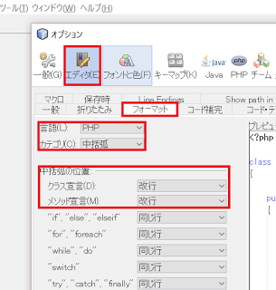

# Day 07　FuelPHPを快適に開発するためのNetBeansで設定まとめ

このブログは[FuelPHP Advent Calendar 2015](http://qiita.com/advent-calendar/2015/fuelphp)の7日目です。  
  
 昨日は[@wata](http://qiita.com/wata)さんの[「DBUnit拡張を使ったFuelPHPのテストを考える」](http://qiita.com/wata/items/22bf3ad75a854aa8f119)でした。  
 今日はみんな大好きNetBeansの話します。  
 それでは早速行きましょう。  
  
 まずはNetBeansのダウンロードリンクです。  
  
## [あなたとNetBeans、今すぐダウンロード](https://netbeans.org/downloads/)

  
 普段IDEを使ってない！って人はこちらも合わせてどうぞ。  
  
## [PHPerがNetBeansを使いたくなる７つの理由](http://soudai1025.blogspot.jp/2013/05/phpernetbeans.html)

  
 インストールが済んだら本題です。  
  
### 1. ルーク、FuelPHPプラグインを使え！！

兎にも角にもまず入れるのはこれです。  
[@junichi\_11](https://twitter.com/junichi_11)さんが作っているこのプラグインを使いましょう。  
[@junichi\_11](https://twitter.com/junichi_11)さんがまとめてるブログはこちらです。  
  
## [NetBeansではじめる FuelPHP](http://junichi11.com/?p=3132#more-3132)

  
 このプラグインを使うとNetBeans上からスケルトンを作ったり、正しくFuelPHPの補完や関数ジャンプ出来るようになります。  
 Coreのコードを読んだり、知らないメソッドを知るきっかけにもなるので是非ご利用ください。  
 僕がPHPStormに完全に移行出来ない理由はこのプラグインがあるからと言っても過言ではありません。  
 Symfony2書く時とかはもう完全にPHPStormなんですけどね。  
 完全無料環境なのでお財布に優しいです！！  
  
### 2. その他の設定

  
**■Windowsの人は必須**  
  
  
-   Show and change line ending
-   Change Line Ending on Save

  
  
 Show and change line endingは改行コードをLFにしたり今の改行コードを表示したりします。  
 Change Line Ending on Saveはデフォルトの改行コードを指定して保存するときに一括して改行コードを変更して保存してくれます。  
 私はLF固定にしてます。  
 あとはここからはお好みですが私はvagrantプラグインを入れてNetBeans上からを操作できるようにしてます。  
 vagrantを操作するためだけにターミナルを開かなくていいので便利です。  
 更にwindowsはsshクライアントがデフォルトで入っていませんがvagrantへのsshは出来るようになります。  
 gitからvagrantの使い方まで知りたい！って人は[@kenji\_s](https://twitter.com/kenji_s)さんの本を読むと全部書いてあります。  
  
* 『[はじめてのフレームワークとしてのFuelPHP 改訂版](http://www.amazon.co.jp/dp/4899774222/)』
  
 PHPUnitなどの設定はお好みでどうぞ。  
 個人的にはPHPUnitのバージョンにテストコードが依存することがあるのでvagrant側で実行する事多いです。  
 プロジェクトが一つでチームで同じバージョンを共有できる場合などはインストールしてIDE上で実行する方が便利だと思います。  
  
### 3. インデントの乱れは心の乱れ

[PSR-2](http://www.infiniteloop.co.jp/docs/psr/psr-2-coding-style-guide.html)に準拠しないとプルリクエスト送った時に怒られます（自分は怒られた事がある）  
 なのでフォーマットを指定しましょう。  
  
  
1.  ツール→オプション→エディタ→フォーマット
2.  言語を「PHP」
3.  カテゴリを「中括弧」
4.  クラス宣言とメソッド宣言を「改行」に変更

  
  

  
 ちなみにPSR-2準拠だとインデントはタブでは無くスペース4つです。  
 そしてPHPの予約語は小文字で使用しなければなりません。  
 つまりNULLはnullです。  
 デフォルトは大文字なので変更が必要です。  
 やり方はNetBeansの設定ファイルを直接編集します。  
 Windowsでエディタで編集する場合は管理者権限が必要ですのでご注意ください。  
  
 **　　\\インストールフォルダ\\php\\phpstubs\\phpruntime\\Core.php**  
  
 私はデフォルトの場所にインストールしたので  
  
 **　　C:\\Program Files\\NetBeans 8.0.1\\php\\phpstubs\\phpruntime\\Core.php**  
  
 です。  
 それを次の通り編集します。  

{lang="php"}
~~~
 define ('TRUE', true);  
 define ('FALSE', false);  
 define ('ZEND_THREAD_SAFE', false);  
 define ('ZEND_DEBUG_BUILD', false);  
 define ('NULL', null);  
~~~

 ↓↓↓  

{lang="php"}
~~~
 define ('true', true);  
 define ('false', false);  
 define ('ZEND_THREAD_SAFE', false);  
 define ('ZEND_DEBUG_BUILD', false);  
 define ('null', null);  
~~~

 これで補完もバッチシです。  
  
  
 以上を設定すればプロジェクト作成時からFuelPHPの対応が完璧になったはずです。  
 快適なプログラミングライフをお楽しみください。  
  
 明日の[FuelPHP Advent Calendar 2015](http://qiita.com/advent-calendar/2015/fuelphp)は[@tanaka8com](http://qiita.com/tanaka8com)さんです。  
 楽しみですね！！

---
オリジナル：　<http://soudai1025.blogspot.jp/2015/12/fuelphpnetbeans.html>
