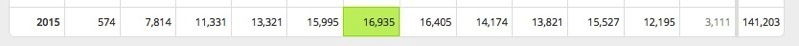

# Day 08　初心者向けFuelPHPチュートリアルサイトを1年半運営した結果

[FuelPHP Advent Calendar 2015](http://qiita.com/advent-calendar/2015/fuelphp)に参加させていただきました。8日目の記事です。

初心者向けのFuelPHPのチュートリアルサイトを運営して1年半ほど経過しましたので、今年1年のアクセスの状況や成果などをご紹介したいと思います。  
 ↓  
[FuelPHP学習帳](http://fuweb.info/)

このサイトの主な内容は、FuelPHPのインストール方法や、お問い合わせフォームやログインフォーム、簡単な掲示板サイトの作り方など、かなり初心者向けのものとなっています。（私が初心者のため）

このサイトの運営記録は過去にも記事を書きました。  
[FuelPHPのチュートリアルをまとめたサイトの月間アクセスがようやく1万PV超えました \#fuelphp](http://tanaka8.com/2015/04/beginner-fuelphp-pv-1man/)

## FuelPHPチュートリアルサイトを始めた動機

PHPで簡単なプログラムを作成することはあったのですが、レベルアップのためPHPフレームワークの勉強を始めようとしたときに、丁度入門書が発売されていたのを見つけて、FuelPHPを勉強し始めました。

FuelPHPで学んだことを自分で読み返せるためのマニュアルとして記録にすることと、プログラミングのチュートリアルサイトでどのくらいアクセスが集まるかという実験のために、サイトを始めました。

## サイトの作り方、記事の作成手順

サイト自体は、WordPressで更新していて、デザインは、Bootstrapの[Flatly](http://bootswatch.com/flatly/)というテーマを改造しています。

記事の内容は、書籍やネット上のサンプルを組み合わせて、ローカル環境で動作確認したものに解説を加える、という形でアップしています。  
 コードはgistにアップしたものをwordpressの記事に貼付けています。

動作確認するローカル環境は、mac+Vagrant+PHP+MySQL+FuelPHP 1.7で、以下の手順で環境を作りました。  
[VagrantでMacにPHP+MySQL環境を構築する](http://tanaka8.com/2014/07/build-php-mysql-vagrant/)

## 記事数はどのくらいか？

2015年12月現在で、42記事になっています。

よく読まる上位3記事は次のとおりです。

1. [お問い合わせフォーム（1）入力のテンプレートを作る](http://fuweb.info/116)
2. [簡易掲示板（1）要件・html作成](http://fuweb.info/248)
3. [Authパッケージでログイン画面作成(1)Authパッケージの設定](http://fuweb.info/220)

## 直近のアクセス数は？

2015年のPV数は以下のとおりで、月にだいたい12,000〜15,000PVくらいのアクセスとなっています。  
 最近、更新が少ないせいかもしれませんが、若干、アクセスが減少気味です。

アクセス元は、9割以上が検索エンジン経由で、残りがブックマークやSNS、他サイトからのリンクから見にきてもらっている状態です。

FuelPHP まとめ Wikiでも紹介いただきました。ありがとうございます。  
[FuelPHP のチュートリアル : FuelPHP まとめ Wiki](http://wiki.fuelphp1st.com/wiki/index/FuelPHP%20%E3%81%AE%E3%83%81%E3%83%A5%E3%83%BC%E3%83%88%E3%83%AA%E3%82%A2%E3%83%AB)

## SNSなどの評価は？

各SNSでフォローいただいている数をまとめます。

はてなブックマーク数：19

[Twitter](https://twitter.com/fuel_php)フォロワー数：17

[Facebookページ](https://www.facebook.com/Fuelphp%E5%AD%A6%E7%BF%92%E5%B8%B3-737399443000788/)のいいね数：9

## サイトから収益はあるの？

G社クリック課金広告から、月にだいたい1,000円前後、Amazon経由で紹介している本が月に1〜2冊売れます。サーバ代とドメイン代が出てる、くらいのイメージです。

ちなみに、クリック課金広告は、ITリテラシー高めの人が多いせいだと思うのですが、PV数に比較してクリックされる割合が異常に低いのが特徴です。  
 （他に運営している不動産関連サイトに比べると半分以下です。）

IT技術関連のウェブサイトで広告収入を得ていくのは簡単ではないかもしれません。

## おわりに

最後までお読みいただき、ありがとうございました。  
 更新頻度が若干落ちていますが、不定期で更新していきますので、ご興味ある方はぜひフォローください。

[FuelPHP学習帳](http://fuweb.info/)

Twitterアカウント  
[@fuel\_php](https://twitter.com/fuel_php)

Facebookページ  
[Fuelphp学習帳Facebookページ](https://www.facebook.com/pages/Fuelphp%E5%AD%A6%E7%BF%92%E5%B8%B3/737399443000788)

---
オリジナル：　<http://tanaka8.com/2015/12/advent-calendar-2015-fuelphp/>
