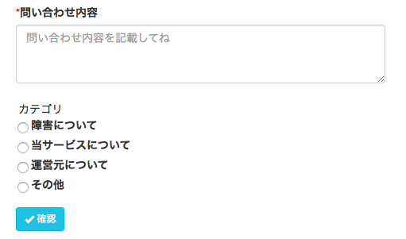
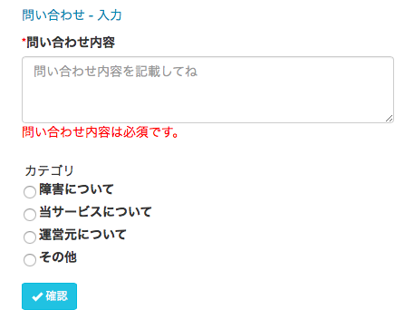

# Day 10　FieldSetでレイアウトもそんなに怖くない！

どうも。  
 [FuelPHP Advent Calendar 2015 の 10 日目](http://qiita.com/advent-calendar/2015/fuelphp)を担当する [@yuse](https://twitter.com/yusesan)です。

今回は、とかくデザインの自由度が・・ってことで、敬遠されがちなFieldSetですが、  
 入門書レベルだと、set\_safeで一括指定で終えているような記述で終わってしまうことが多く、  
 そもそも、使い方からして・・よくわかっていなかったので、まとめてみました。

まず、こんな画面を作りたいと思います。

エラーの場合はこんな感じ。

 

とまあ、なんのことないフツーの画面ですね。

これをFieldSetを使って構築したいと思います。

 

まず、controller

{lang="php", linenos=off}
~~~
  // FieldSet作成
        $form = Fieldset::forge("inputform");
 
        // textarea
        $form->add('comment', '問い合わせ内容', array('type' => 'textarea', 
                                'cols' => 30, 
                                'rows' => 3, 
                                'class' => 'form-control', 
                                'placeholder' => '問い合わせ内容を記載してね'))
              ->add_rule('required')
              ->add_rule('max_length', 300);
 
        // radio
        $list = array(
            '障害について' => '障害について',
            '当サービスについて' => '当サービスについて',
            '運営元について' => '運営元について',
            'その他' => 'その他',
        );
        $form->add('kind', 'カテゴリ', array('options' => $list,
                                                    'type' => 'radio',
                                                    'class' => 'radio-inline'));
 
        // ※Templateコントローラを使用しています。
        $this->template->content = View::forge('contact/index');
~~~

次に、View側。

{lang="php", linenos=off}
~~~

    <?= Form::open(array('action' => '')); ?>
 
    <?php $fieldset = Fieldset::instance('inputform'); ?>
 
    <!-- コメント -->
    <?= $fieldset->field('comment'); ?>
 
     
 
    <!-- カテゴリ -->
    <?= $fieldset->field('kind')->set_attribute('id', 'kindoflove'); ?>
 
    <button type="submit" class="btn btn-info btn-sm">
        <i class="glyphicon glyphicon-ok"></i> 確認
    </button>
    <?= Form::close(); ?>

~~~

FieldSetでも、インスタンスを呼び出して、そこにset\_attributeしていくことで、Formクラスのように柔軟にデザインできますね。

次に form.php

{lang="php", linenos=off}
~~~
// regular form definitions
    'prep_value'                 => true,
    'auto_id'                    => true,
    'auto_id_prefix'             => 'form_',
    'form_method'                => 'post',
    'form_template'              => "{open}\n{fields}\n{close}",
    'fieldset_template'          => "{open}\n{fields}\n{close}",
    'field_template'             => "{required}{label}{field} {description} {error_msg}\n",
    'multi_field_template'       => "<ul style=\"list-style:none;padding:3px;\">{group_label}{required}{fields}<li class=\"{error_class}\">{field} {label}</li>\n{fields}{description}</ul>{error_msg}",
    'error_template'             => "{error_msg}",
    'group_label'                 => '{label}',
    'required_mark'              => '*',
    'inline_errors'              => true,
    'error_class'                => null,
    'label_class'                => null,
~~~

という感じです。

FieldSetでデザインするとき、ネックになってくるのはここですね。デフォルトはTableレイアウトになっているのでその辺を撤廃してます。

チェックボックスやラジオボタンのような複数選択系は、multi\_field\_templateのレイアウトが利用されますが、一時的に別のレイアウトに変えたい場合は、下記のような感じで直接指定してやります。

{lang="php", linenos=off}
~~~
$fieldset = Fieldset::forge('edit');
 
$fieldset->set_config('multi_field_template', '<ul style=\"list-style:none;padding:10px;\">{group_label}{required}{fields}<li class=\"{error_class}\">{field} {label}</li>\n{fields}{description}</ul>{error_msg}');
 
//…ここから先は、Fieldsetの定義が続く。
~~~

まだまだですが、こんな感じで、FieldSetに親しんでいければと思います。

おわり。ご静聴ありがとうございました〜！

---
オリジナル：　<http://osalon.jp/yusepress/?p=718>
