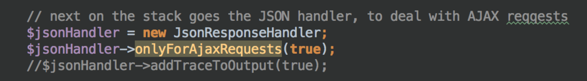

# Day 13　FuelPHP 2.0 α版を使ってみた

## はじめに

これは、[FuelPHP Advent Calendar 2015](http://qiita.com/advent-calendar/2015/fuelphp) の13日目です。

現在、FuelPHP 1.7.3が安定版として公式ページに公開されていますが、今年1月に[FuelPHP 2.0 α がリリース](http://fuelphp.com/blogs/2015/01/v2-alpha-1-release)されました。 FuelPHP 2.0 α版を実際にインストールして使ってみようと思います。

## FuelPHP1系との違い

アプリケーションとコンポーネントという仕組みを導入するにあたって大きな変更になるため 1系とは別のgithubアカウントで管理されています。1系は[fuel](https://github.com/fuel)ですが、2系は[fuelphp](https://github.com/fuelphp)です。

おおまかな変更は以下です。

-   PHP5.4以上
-   FuelPHPのパッケージがすべてcomposerで管理
-   componentという単位でアプリケーションを作成する
-   複数のcomponentを追加でき、別のcomponentを利用することも可能
-   命名規則がスネークケースからキャメルケースに変更

例えば、デフォルトのWelcomeクラスは以下のように変わりました。

``` {.code .lang-php data-lang="php" data-unlink=""}
<?php
class Controller_Welcome extends Controller
{
    /**
    * The basic welcome message
    *
    * @access  public
    * @return  Response
    */
    public function action_index()
    {
        return Response::forge(View::forge('welcome/index'));
    }

    /**
    * A typical "Hello, Bob!" type example.  This uses a Presenter to
    * show how to use them.
    *
    * @access  public
    * @return  Response
    */
    public function action_hello()
    {
        return Response::forge(Presenter::forge('welcome/hello'));
    }
    // ・・・省略
}
```

``` {.code .lang-php data-lang="php" data-unlink=""}
<?php
class Welcome extends Helpers\Base
{
    /**
    * The basic welcome message
    *
    * @access  public
    * @return  View
    */
    public function actionIndex()
    {
        return \View::forge('welcome/index');
    }

    /**
    * A typical "Hello, Bob!" type example.  This uses named parameters in
    * the route, and a Presenter to show you how to use them.
    *
    * @access  public
    * @return  Presenter
    */
    public function actionHello()
    {
        return \Presenter::forge('welcome/hello')
            ->set('name', $this->request->getParam('name', 'World'));
    }
    // ・・・省略
}
```

とても読みやすくていいですね！

## 動作確認

私は、AnsibleとVagrantでCentOS6.5＋PHP5.6+PHP-FPM＋Nginx1.8+MySQL5.6の環境をMac上に作成して検証しました。

[fuelphp/fuelphp · GitHub](https://github.com/fuelphp/fuelphp) をクローンして、composerで必要なライブラリをインストールします。

``` {.code .lang-sh data-lang="sh" data-unlink=""}
git clone https://github.com/fuelphp/fuelphp.git fuelphp2
cd fuelphp2
composer install
```

その後、設定したドメインにアクセスしてみると、


``` {.code data-lang="" data-unlink=""}
Fatal error: Call to undefined method Whoops\Handler\JsonResponseHandler::onlyForAjaxRequests() in /vagrant/fuelphp2/vendor/fuelphp/foundation/src/Error.php on line 215
```

エラーが発生。。。修正しましょう。。。[^fn5450b400]

## fuelphp/foundation の修正

エラーの通り、fuelphp/foundationリポジトリのError.php:215あたりを見てみると

{lang="php", linenos=off}
``` {.code .lang-php data-lang="php" data-unlink=""}
<?php
$this->whoops->pushHandler($this->pagehandler);

// next on the stack goes the JSON handler, to deal with AJAX reqqests
$jsonHandler = new JsonResponseHandler;
$jsonHandler->onlyForAjaxRequests(true);
//$jsonHandler->addTraceToOutput(true);

$this->whoops->pushHandler($jsonHandler);
```

どうもこの`$jsonHandler->onlyForAjaxRequests(true);`が定義されていないようです。 今度は`filp/whoops/src/Whoops/Handler/JsonResponseHandler.php`をのぞいてみると`addTraceToOutput`というfunctionが定義されていました。おや？



コメントアウトされてる・・・ということでここのコメントアウトを入れ替えます。(おそらく、変更されることがわかってたのでしょう)

{lang="php", linenos=off}
``` {.code .lang-php data-lang="php" data-unlink=""}
<?php
//$jsonHandler->onlyForAjaxRequests(true);
$jsonHandler->addTraceToOutput(true);
```

これでデフォルトページが表示されると思います。


左下のバージョン情報が「2.0-dev」になっていますね。

## ベンチマーク

では、速度的にはどうなのでしょうか？ 同じ環境で、1.7.3 と 2.0で簡単に比べてみました。

-   1系:
    -   Requests per second: 28.588 \[\#/sec\] (mean)
    -   Time per request: 179.407 \[ms\] (mean)
-   2系
    -   Requests per second: 4.754 \[\#/sec\] (mean)
    -   Time per request: 1053.7414 \[ms\] (mean)

圧倒的に1系がはやいですねｗコンポーネント化による影響なのでしょうか。

## まとめ

FuelPHP V2 α をインストールして試してみました。 コンポーネント化が進み、コンポーネントを追加するだけで色々カスタマイズができるようになるのは嬉しいなと感じました。例えば、モデル部分をコンポーネント化して、フロントと管理画面両方でさくっと使いまわせるの良いなと思う。

ただ、V2の開発がほぼ停止しており、悲しい気持ちです。。。


[^fn5450b400]: プルリクを送っておこうと思います

---
オリジナル：　<http://gurimmer.hatenablog.com/entry/2015/12/13/021805>
