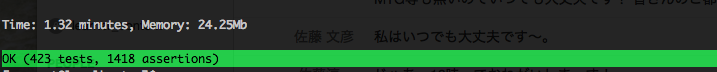
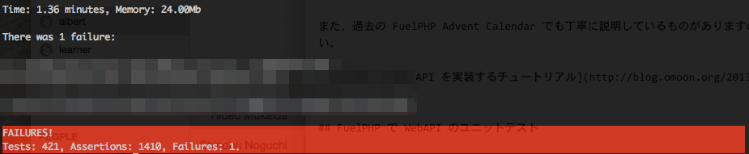
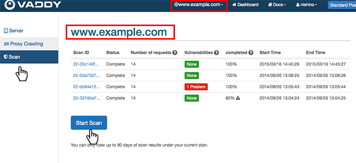
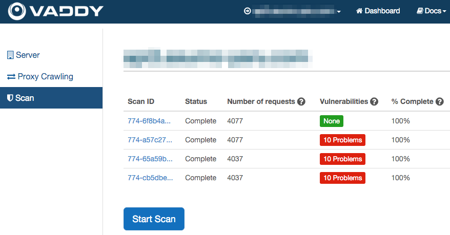

# Day 18　FuelPHPで開発したWebAPIをVAddyで脆弱性テストする話


[FuelPHP Advent Calendar 2015](http://qiita.com/advent-calendar/2015/fuelphp) の18日目を担当します @hmukaida です。よろしくお願い致します。

今回は、FuelPHP で開発している WebAPI を VAddy というクラウド型Web脆弱性検査ツールを使ってテストする話をしたいと思います。FuelPHP 部分は弱めかと思いますが、18日目が空いていたので参加させていただきました。

## はじめに

フレームワークを使った開発では、ユニットテストやE2Eテストを行うのはもはや日常になってきているかと思います。当然私達の現場でも実施しています。

特にセキュリティ対策としては、各種サーバでの対策もそうですが、フレームワーク独自の対策を施したり、[IPAの安全なウェブサイトの作り方](https://www.ipa.go.jp/security/vuln/websecurity.html)を読み込み実践したりと様々取り組んできました。

しかし、数あるAPIの様々なリクエストにどれくらいの脆弱性が潜んでいるのか不安でなりません。API のリクエストやレスポンス、コントローラやモデルのテストはできても、悪意あるリクエストに対して大丈夫なのか。費用はあまりかけられないが、どうにかならないか。そこで、私達は [VAddy](http://vaddy.net/ja/)というツールを見つけ利用することにしたのです。

## FuelPHP で WebAPI 開発
FuelPHP による WebAPI 開発は非常に単純です。標準で RESTful サポートの Rest コントローラが組み込まれています。日本語のドキュメントも整備されています。

[FuelPHP/Rest コントローラ](http://fuelphp.jp/docs/1.8/general/controllers/rest.html)

ドキュメントから引用しますが、下記の通り記載し、設定ファイルを少し記述するだけで API を実装することができるのです。

``` 
class Controller_Test extends Controller_Rest
{
    public function get_list()
    {
        return $this->response(array(
            'foo' => Input::get('foo'),
            'baz' => array(
                1, 50, 219
            ),
            'empty' => null
        ));
    }
}
``` 
例えば上記記述をすれば、http://localhost/test/list.json?foo=bar という形でリクエストを送り、レスポンスを得ることができます。

``` 
{
    "foo":"bar",
    "baz":[1,50,219],
    "empty":null
}
``` 

また、過去の FuelPHP Advent Calendar でも丁寧に説明しているものがありますので参考にしてください。

[FuelPHP 5 分で API を実装するチュートリアル](http://blog.omoon.org/20131219/925)


## FuelPHP で WebAPI のユニットテスト

FuelPHP は自動ユニットテストを念頭に作られており、PHPUnit のテストフレームワークを基にしたドキュメントが整備されています。

[FuelPHP/ユニットテスト](http://fuelphp.jp/docs/1.8/general/unit_testing.html)

PHPUnit のインストール、ユニットテストの作成、ユニットテストの実行と記載されていますので順を追って準備できるかと思います。

API のテストでは、実際にリクエストを送り、レスポンスをチェックするテストを組み込みました。正常なリクエストで正常なレスポンスが返ってくるか、異常なリクエストでエラーのレスポンスが返ってくるのかといった感じです。



テストが成功すると嬉しいですね。



エラーになると残念ですが、改善箇所が見つかったと前向き修正を行います。

個人的にとても重宝しているのが、「テストグループ」に分けられる点です。GET のみのテストグループ、POST のみのテストグループ、全テストグループなど設定し、テストしたい要件に応じてテストしています。

``` 
/**
 * @group App
 * @group Login
 */
class Test_Model_Login extends TestCase
{
    public function test_foo()
    {
    }
}
``` 

@group 属性を使いひとつのテストクラスを任意のテストグループに割り当てることができます。App に割り当てたテストグループを実行するには、下記コマンドを実行するだけです。

``` 
$ php oil test --group=App
``` 

簡単ですね。

## VAddy とは

> VAddyはCIツールと連携し、継続的なセキュリティテストを実現するクラウド型Web脆弱性検査ツールです。

[VAddyプロモーション動画](https://www.youtube.com/watch?v=kKT2NxyctHE)

VAddyについては、上記のプロモーション動画を見ていただくか、下記の説明資料を見てください。VAddyの宣伝ではないので詳細は割愛させていただきます。

[継続的セキュリティテストVaddy説明資料](http://www.slideshare.net/ichikaway/vaddy)

導入は非常に簡単なのと、Free プランでもSQLインジェクション検査、XSS検査を実施することが可能です。本当に助かります。

## VAddy で WebAPI の脆弱性テスト

実施した手順としては次の通りです。

1. VAddy アカウントの作成及び初期設定：<http://vaddy.net/ja/docs/step01.html>
2. API サーバのクロールと実行：<http://blog-ja.vaddy.net/post/113134391706/vaddy-restapi-json-scan>
3. スキャンの実行・確認：<http://vaddy.net/ja/docs/step03.html>

特に、「2.API サーバのクロールと実行」では、下記シェルを作成し実行しています。

``` 
#!/bin/sh
export VADDY_TEST=on
export FUEL_ENV=test

PROXY='--proxy http://54.92.84.100:10080'

## begin: VAddy のクロール開始
curl $PROXY http://hogehoge.com/vaddy-abc12345.html?action=begin

## phpunit: API のユニットテスト実行
php oil test group=api_all

## commit: VAddy のクロール確定
curl $PROXY http://hogehoge.com/vaddy-abc12345.html?action=commit
``` 
ここまでくれば、脆弱性テストのクロールが終了していますので、VAddy の Scan ページより脆弱性テスト実行(Start Scan)します。



実行後は結果画面が表示されますので、問題があれば、どういうリクエストを発行したのか確認できるので大変便利です。

直近では、下記の通り、私達の WebAPI で10個の脆弱性が発見されましたが、VAddy で発見できたため事前に対応することができました。



これで安心して帰路につけます。よかったですね。

## まとめ
* FuelPHP による WebAPI の実装は非常にシンプルです
* FuelPHP によるユニットテストも容易です
* VAddy というツールを使い、脆弱性のテストができ問題発見、修正ができました

私達はさらに CI ツールと連携しています。プログラム開発及びユニットテストを実施後、プルリクエストを送り、マージされた後、自動的にテストサーバに deploy し、その後脆弱性テストを行っています。そのあたりについては、下記が参考になるかと思いますので添えておきます。

* [VAddy](http://vaddy.net/ja/)
* [Jenkins連携／webAPI スタートアップガイド](http://vaddy.net/ja/docs/step03-j.html)
* [JenkinsからWebアプリに脆弱性検査し、結果をHipchatに通知](http://blog-ja.vaddy.net/post/102410414941/vaddy-hipchat-notification)

[FuelPHP Advent Calendar 2015](http://qiita.com/advent-calendar/2015/fuelphp)としてはどうかという着地ですが、少しでも皆様のお役に立てれば幸いです。

---
オリジナル：　<http://qiita.com/hmukaida/items/e35237a0e58619ba4aa4>
