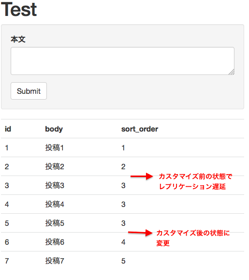

# Day 20　更新処理に関わる参照 SQL はマスタ DB を参照するようにカスタマイズする

こんにちは。[2015年 FuelPHP Advent Calendar](http://qiita.com/advent-calendar/2015/fuelphp) 20日目を担当させて頂く [@uzura8](https://twitter.com/uzura8) です。  
昨日は [@goosys](http://qiita.com/goosys) さんの「[EAVコンテナでカスタムフィールドっぽいことをする](http://qiita.com/goosys/items/38f1a4681aab9bd19912)」でした。

私は普段業務でプログラミングしていない趣味エンジニアです。暇な時に　OSS の SNS エンジン(https://github.com/uzura8/flockbird) を開発してます。技術ブログも書いたことないので若干不安ですが、宜しくお願いします。

さて本日は DB 関連のカスタマイズについてです。
参照系の負荷分散の為、 master/slave 環境がよく使われますが(最近はどうなんでしょう？)、FuelPHPも複数 DB に対応しています。

* 参考: [fuelPHPでMySQLのREPLICATION (Master-Slave)を使う](http://kiriya-system.hatenablog.com/entry/2014/01/28/195553)

## 参照時の接続先を明示的に指定する方法
Slave が複数ある場合はランダムで参照先DBが選ばれますが、明示的に指定してやることも出来ます。

{title="fuel/app/config/db.php", lang="php"}
``` PHP:fuel/app/config/db.php
return array(
  'default' => array(
    'type'        => 'pdo',
    'connection'  => array(
      'dsn'        => 'mysql:host=xxx.xxx.xxx.xxx;port=3306;dbname=db_master',
      'username'   => 'user',
      'password'   => 'pass',
    ),
            【略】
    'readonly' => array('slave1', 'slave2'),
  ),
  // SlaveDB1 設定
  'slave1' => array(
    'type'        => 'pdo',
    'connection'  => array(
      'dsn'        => 'mysql:host=xxx.xxx.xxx.xxx;port=3307;dbname=db_slave1',
      'username'   => 'user',
      'password'   => 'pass',
    ),
            【略】
  ),
  // SlaveDB2 設定
  'slave1' => array(
    'type'        => 'pdo',
    'connection'  => array(
      'dsn'        => 'mysql:host=xxx.xxx.xxx.xxx;port=3308;dbname=db_slave2',
      'username'   => 'user',
      'password'   => 'pass',
    ),
            【略】
  ),
);
```

と slave を複数設定している場合、

{lang="php"}
``` PHP
// slave1 を参照する場合
Model_Hoge::query()->connection('slave1')->get();

// slave2 を参照する場合
Model_Hoge::query()->connection('slave2')->get();
```

と、connection() で接続先 DB を指定してやることができます。


## 参照時の接続先指定に master は指定できない？

ただ前から気になっていたのですが、

{lang="php"}
``` PHP
Model_Hoge::query()->connection('default')->get();
```
とやっても Master である db_master が参照されません。

master/slave 環境では、レプリケーションが遅延した場合に影響がないように、更新処理に関わる参照 SQL は master を参照したいところです。そうしないと、最新でない情報にもとづいてレコードが更新されたり、更新後の表示が古かったりしてしまいます。

なぜ「connection('default')」が参照されないかについて調べてみました。

\Orm\Query::get() では

{title="fuel/packages/orm/classes/query.php", lang="php", linenos=off}
``` PHP:fuel/packages/orm/classes/query.php
1265     $query = call_fuel_func_array('DB::select', $select);

【略】

1293     $rows = $query->execute($this->connection)->as_array();
```

という風に DB クラスが呼ばれているので、上記の ORM の SELECT 文は、結局

{lang="php"}
``` PHP
DB::select()->from('hoges')->execute('default')->as_array();
```

が実行されます。  
「execute()」の引数に接続させたい connection 名を文字列で指定するのですが、そちらでは

{title="fuel/core/classes/database/query.php", lang="php"}
``` PHP:fuel/core/classes/database/query.php
namespace Fuel\Core;

class Database_Query
{
　　【略】
  public function execute($db = null)
  {
    if ($this->_connection !== null and $db === null)
    {   
      $db = $this->_connection;
    }   

    if ( ! is_object($db))
    {   
      // Get the database instance. If this query is a instance of
      // Database_Query_Builder_Select then use the slave connection if configured
      $db = \Database_Connection::instance($db, null, ! $this instanceof \Database_Query_Builder_Select);
    }
　　【略】
}
```

と、渡された引数「$db」がオブジェクトでなければ、

Database_Connection 

のインスタンスを取得しており、SELECT 文の場合は Database_Connection::instance() の第3引数「! $this instanceof \Database_Query_Builder_Select」が false となり、
結果として強制的に read_only の connection となってしまうことがわかりました。  
ORM の SELECT 文で「->connection('default')」、DB クラスで「->execute('default')」を指定しても意味が無いわけです。

## やりたいこと

ここでやりたいことを整理しますと

1. 参照 SQL も更新処理に関わる場合は master を参照させたい
2. 更新時の参照 SQL は master に、非更新時は slave に自動的に接続されるようにしたい

です。  
SQL書く時にいちいち接続先を指定するのは面倒です。指定し忘れることもありますし、勝手に振り分けられるのが望ましいです。
(他のFWではどうなってるんでしょう？ Fuel 以外あまり詳しくないので、よくわかりません)

「やりたいこと1」を実現するには、上記の Database_Query::execute() の Database_Connection::instance() している箇所を変更するしかなさそうです。  
Database_Query:: execute() の引数に Database_Connection::instance() を予め生成しておいて渡す方針も考えましたが、\Orm\Query の接続先指定プロパティ $this->connection が文字列を前提にしているぽかったので、その方針は無理そうです。
ので、Database_Query クラスの execute() メソッドをカスタマイズすることにしました。

また「やりたいこと2」を実現するために、「更新時」かどうかを「トランザクション中かどうか」で判定すればいいと考えました。
更新処理はトランザクションをかけていると思うので、トランザクション中であれば参照 SQL でも master を、そうでない時の参照 SQL は slave に接続されればよさそうです。

「Database_Query クラスの execute() メソッドをカスタマイズ」には、[コアクラスの拡張](http://fuelphp.jp/docs/1.8/general/extending_core.html)を参考にしました。  
FuelPHP はドキュメントがしっかりしていて、日本語訳もあるのがいいですね。(翻訳していただいた皆様、ありがとうございます！)

カスタマイズ内容は <https://github.com/uzura8/fuel_sample/commit/d9fad928e6c6611c422a2d9131fc4d06ba700e0b> をご確認ください。
抜粋は下記です。

{linenos=off}
``` ~diff
diff --git a/fuel/app/bootstrap.php b/fuel/app/bootstrap.php
index 589bcab..6b2f3a6 100644
--- a/fuel/app/bootstrap.php
+++ b/fuel/app/bootstrap.php
@@ -5,6 +5,7 @@ require COREPATH.'bootstrap.php';
 \Autoloader::add_classes(array(
  // Add classes you want to override here
  // Example: 'View' => APPPATH.'classes/view.php',
+ 'Database_Query' => APPPATH.'classes/database/query.php',
 ));
 
 // Register the autoloader
diff --git a/fuel/app/classes/database/query.php b/fuel/app/classes/database/query.php
new file mode 100644
index 0000000..e9a504d
--- /dev/null
+++ b/fuel/app/classes/database/query.php
@@ -0,0 +1,19 @@
+<?php
+
+class Database_Query extends \Fuel\Core\Database_Query
+{
+ public function execute($db = null)
+ {
+   if ($this->_connection !== null and $db === null)
+   {
+     $db = $this->_connection;
+   }
+
+   if ( ! is_object($db) && \DB::in_transaction())
+   {
+     $db = \Database_Connection::instance($db, null, true);
+   }
+
+   return parent::execute($db);    
+ }
+}
```
  
改修内容は、拡張した「Database_Query クラスの execute() メソッド」で「DB::in_transaction()」時は「Database_Connection::instance()」の第3引数(writable かどうか)に true を渡すようにしたうえで、親クラスにもどしてやるという内容です。  
これで大丈夫でしょうか？  
とりあえず検証してみます。

## 検証①
検証のため、レプリケーション環境をたてる必要があります。  
私の環境が Mac なので、下記の記事を参考にしました。

* [MySQLのレプリケーション遅延をローカルで再現させる手順 その1](http://cflat-inc.hatenablog.com/entry/20130812/1376265269)
* [MySQLのレプリケーション遅延をローカルで再現させる手順 その2](http://cflat-inc.hatenablog.com/archive/category/MySQL)

記事内容のままで構築できました。  
mysqld_multi 便利ですね。  
homebrew でいれた MySQL に最初から入っている点もありがたいです。

### 検証用のテーブル・処理
検証用に、下記のテーブルと処理を用意しました。  
https://github.com/uzura8/fuel_sample より取得可能です。  
投稿時にあえて参照(並び順用の数値の取得)を行うようにしてます。

#### テーブル

``` ~SQL
CREATE TABLE `posts` (
  `id` int(11) NOT NULL AUTO_INCREMENT,
  `body` text COLLATE utf8_unicode_ci NOT NULL,
  `sort_order` int(11) DEFAULT NULL COMMENT 'Order to sort',
  PRIMARY KEY (`id`)
) ENGINE=InnoDB DEFAULT CHARSET=utf8;
```

#### コントローラ

{title="fuel/app/classes/controller/post.php", lang="php"}
``` PHP:fuel/app/classes/controller/post.php
class Controller_Post extends Controller
{
  public function action_index()
  {
    $post = Model_Post::forge();
    $val = self::get_validation($post);
    $posted = array();
    $error_message = '';
    
    if (Input::method() == 'POST')
    {
      try
      {
        if ( ! Security::check_token()) throw new FuelException('csrf error');
        if ( ! $val->run()) throw new FuelException($val->show_errors());
        $posted = $val->validated();
    
        DB::start_transaction();
        $post->save_with_sort_order($posted['body']);
        $posts = Model_Post::get_all();
        DB::commit_transaction();
      }
      catch(FuelException $e)
      {
        if (DB::in_transaction()) DB::rollback_transaction();
        $error_message = $e->getMessage();
      }
    }
   
    if (!isset($posts)) $posts = Model_Post::get_all();
 
    return Response::forge(View::forge('post/index', array(
      'posted' => $posted,
      'error_message' => $error_message,
      'posts' => $posts,
    )));
  }
}
```

#### モデル

{title="fuel/app/classes/model/post.php", lang="php"}
``` PHP:fuel/app/classes/model/post.php
<?php

class Model_Post extends \Orm\Model
{
    【略】

    public function save_with_sort_order($body)
    {
        $this->body = $body;
        if ( ! $this->sort_order)
        {
            // 更新処理時にあえて参照を行うようにした(本来は他のやり方をすべき)
            $this->sort_order = self::get_max_sort_order() + 1;
        }

        return $this->save();
    }

    public static function get_max_sort_order()
    {
        return (int)self::query()->max('sort_order');
    }

    public static function get_all()
    {
        return self::query()->order_by(array('sort_order' => 'asc'))->get();
    }
}
```


カスタマイズ前後で、master と slave に発行された SQL をログで確認します。  
「long_query_time = 0」を設定し、スロークエリログを確認します。

### カスタマイズ前の結果

#### master の SQL ログ

``` ~
$ cat /usr/local/var/mysql1/slow_query.log|grep -v ^#|grep -v ^SET

START TRANSACTION;
INSERT INTO `posts` (`body`, `sort_order`) VALUES ('投稿1', 1);
COMMIT;
```

#### slave の SQL ログ

``` ~
$ cat /usr/local/var/mysql2/slow_query.log|grep -v ^#|grep -v ^SET

SELECT MAX(`t0`.`sort_order`) AS max_result FROM posts AS t0;
SELECT t0.body AS t0_c0, t0.sort_order AS t0_c1, t0.id AS t0_c2 FROM posts AS t0 ORDER BY t0.sort_order ASC;
```

更新処理時の「SELECT MAX()」が slave で実行されています。

### カスタマイズ後の結果

#### master の SQL ログ

``` ~
$ cat /usr/local/var/mysql1/slow_query.log|grep -v ^#|grep -v ^SET

START TRANSACTION;
SELECT MAX(`t0`.`sort_order`) AS max_result FROM `posts` AS `t0`;
INSERT INTO `posts` (`body`, `sort_order`) VALUES ('投稿2', 2);
SELECT `t0`.`body` AS `t0_c0`, `t0`.`sort_order` AS `t0_c1`, `t0`.`id` AS `t0_c2` FROM `posts` AS `t0` ORDER BY `t0`.`sort_order` ASC;
COMMIT;
```

#### slave の SQL ログ

``` ~
$ cat /usr/local/var/mysql2/slow_query.log|grep -v ^#|grep -v ^SET

なし
```

更新処理時の「SELECT MAX()」が master で実行されていることが確認できました。


## 検証②: レプリケーション遅延時の確認

わざとレプリケーション遅延を発生させ(slave stop して)、投稿を行ってみます。  
検証結果のキャプチャを添付します。



上記の様にカスタマイズ前だと、sort_order が遅延した slave が参照されるので、加算されない値で保存されてしまいました。  
カスタマイズ後の状態に変更して投稿すると、master が参照されるため、sort_order の値は正しく加算されています。

いかがでしょうか？  
FuelPHP には Observer という更新処理時に自動的に実行する処理を定義できる便利な機能が有るのですが、Observer で参照を行っている場合、強制的に SlaveDB が参照されてしまいます。その結果、レプリケーション遅延時に正しくない値で保存されてしまうことがあり得ますが、更新処理時にトランザクションを行っておけば、上記改修でその事象は回避できそうです。

ただ、上記改修の副作用については確認できておりません。  
上記改修をすると、トランザクション中に slave を参照したい時でも master が参照されることになります。  
またもっといいやり方があるかもしれません。もっといいやり方を知っている方がいれば教えていただければ助かります。

あと個人的に、slave が複数 DB ある環境で、各 DB が参照される割合を指定させたいです。DB ごとに用途、リソースが異なるケースがありますので。  
現状の Fuel だと単純なランダムで接続先 slave が選択されるので、各 slave に重み付けを指定して、それに基づいた割合で参照されるのが望ましいです。(できれば config/db.php で指定したいです)
その辺はそのうちやりたいと思います。


技術ブログをちゃんと書くの初めてでしたが(書くの大変ですね＞＜)、お役にたてれば幸いです。  
あと個人的に取り組んでる FuelPHP 製の OSS の SNS エンジンも触ってみていただけると嬉しいです。

* <http://uzura8.github.io/flockbird/>
* [Demoサイト](http://demo.flockbird.uzuralife.com/)

[2015年 FuelPHP Advent Calendar](http://qiita.com/advent-calendar/2015/fuelphp) 20日目は以上です。

ありがとうございました！

---
オリジナル：　<http://qiita.com/uzura8/items/cd82c8a4af90bbcef91c>
