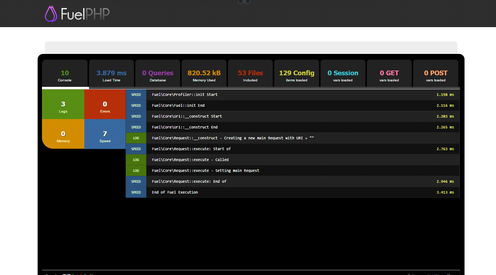

# Day 24　KUSANAGI で FuelPHP を動かす

FuelPHP アドベントカレンダー24日目です。

## KUSANAGIとは

まずはじめに[KUSANAGI](http://kusanagi.tokyo/)について簡単に説明します。KUSANAGIは、プライム・ストラテジー会社が開発して公開している仮想マシン・イメージです。WordPressが高速に実行できるようにチューニングされているので、WordPressを使うときに非常に重宝しますが、WordPress以外のアプリケーションを動かすこともできます。WordPressに関しては[さくらクラウドにKUSANAGIをインストールしてみた](https://rescuework.nagoya/blog/kusanagi-sakura/)に書きましたので、そちらを参照してください。

### 様々なパブリッククラウドに対応
2015年12月24日時点で、下記のクラウドサービスに対応しています。

* KUSANAGI for Microsoft Azure
* KUSANAGI for SoftLayer
* KUSANAGI for AWS
* KUSANAGI for さくらのクラウド
* KUSANAGI for ConoHa
* KUSANAGI for Z.com
* KUSANAGI for S-Port
* KUSANAGI for IDCF クラウド

私は[さくらのクラウド](http://cloud.sakura.ad.jp/)を使っています。

### KUSANAGIのPHPバージョン

KUSANAGIでは、PHP5.6、PHP7、HHVMが用意されています。2015年12月時点でPHP7が用意されているイメージは、私が知っている範囲ではKUSANAGIだけですので、とても貴重だと思います。  
複数のPHPバージョンが用意されているだけでなく、

* kusanagi php7
* kusanagi php-fpm
* kusanagi hhvm

というコマンドを実行することで、切り替えることができます。php7を試してみて、やっぱりphp5.6にしよう、といったことも簡単に行うことができます。  
早々にPHP7対応していただいたプライム・ストラテジーの皆様に感謝します。

## FuelPHPを動かしてみる

FuelPHPバージョン1.7.3をKUSANAGI上で動かしてみました。まずはphp5.6系の場合です。

インターネット越しにアクセス、プロファイリング機能を有効にした状態で、上のような数字になります。FuelPHPは元々高速なほうですが、この数字はかなり速いと思われます。KUSANAGIを使うと、WordPress以外でも高速に使えるようです。

### FuelPHP1.7.3 + PHP7 は動かない

FuelPHP1.7.3は、PHP7に対応していません。PHP7で実行すると、下記のようにエラーとなります。

Fatal error: Uncaught Error: Call to undefined method Error::shutdown_handler() in xxx.php:77 Stack trace: #0 [internal function]: {closure}() #1 {main} thrown in xxx.php on line 77

となります。PHP7でErrorクラスが導入されたため、FuelPHPの同名のクラスと名前が被ってしまったからのようです。詳細はFuelPHP Forumsの[Error handler error in PHP7](http://fuelphp.com/forums/discussion/13696/error-handler-error-in-php7)をご覧ください。

PHP7に対応したFuelPHP1.7.4は、現時点では準備中ですので、FuelPHP + PHP7 はもう少しお預けとなりそうです。

---
オリジナル：　<http://qiita.com/ounziw/items/a18c367849b8b2083dc3>
